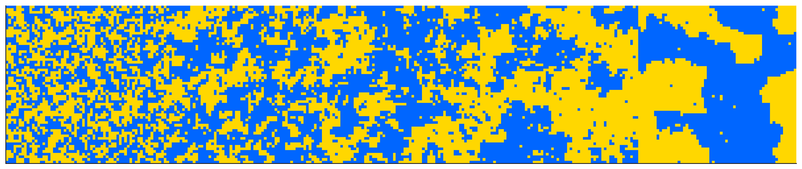
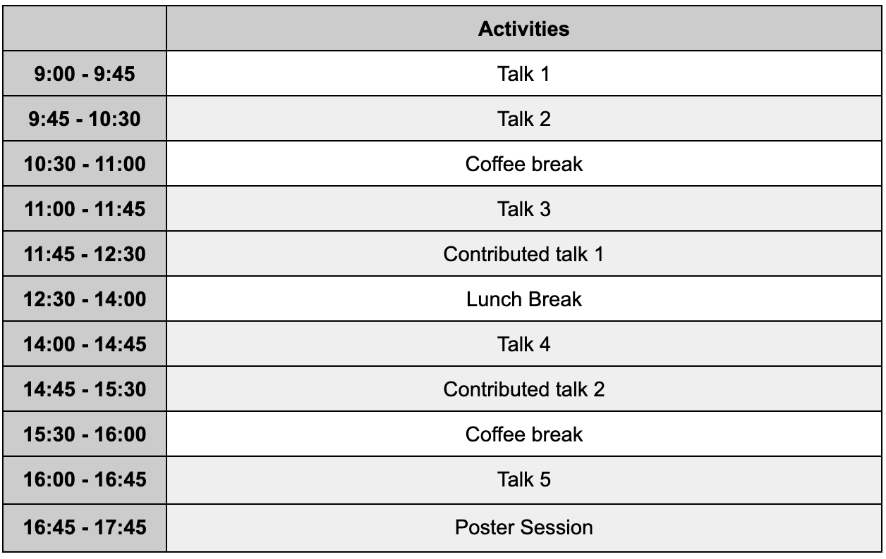
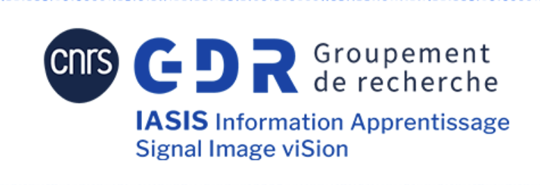

Phase transitions have emerged as a unifying theme across probability, statistics, statistical physics, and machine learning. In many high-dimensional inference problems—ranging from community detection in networks and sparse signal recovery to learning with neural networks—one observes sharp thresholds that separate regimes of possibility, impossibility, and computational hardness. Understanding these transitions has become central to both theory and practice: they reveal fundamental limits of what can be inferred from data, clarify the gap between information-theoretic and algorithmic feasibility, and provide new tools to analyse the behavior of algorithms.

This thematic day will bring together researchers from diverse fields to discuss recent progress, open challenges, and emerging connections around phase transitions in high-dimensional inference.

__Organisers:__  Bruno Loureiro (DI-ENS & CNRS) and Marylou Gabrié (LPENS)

# Travel support

This thematic day is part of the [GdR IASIS](https://gdr-iasis.cnrs.fr/) (*Information, Apprentissage, Signal, Image et ViSion*).  The GdR IASIS can cover the travel costs of up to 2 people from labs which are part of the GdR. Note accomodation costs cannot be covered.

# Schedule
 

# Venue :

Salle de Conférence IV

[Laboratoire de physique de l'Ecole Normale Supérieure](https://www.lpens.ens.psl.eu/)

[24 rue Lhomond, 75005 Paris](https://maps.app.goo.gl/cHvQJKQKihuqtkmf6)

France

# Registration

Participants should register by filling [this form]().

# Speakers

- [Guilhem Semerjian](https://www.phys.ens.psl.eu/~guilhem/) (LPENS)
- [Louise Budzynski](https://scholar.google.com/citations?user=QQtOq2EAAAAJ&hl=fr) (DI-ENS)
- [Ludovic Stéphan](https://www.lstephan.fr/) (ENSAI Rennes)
- [Freya Behrens](https://scholar.google.com/citations?user=6zjf_R8AAAAJ&hl=de) (EPFL)
- [Vittorio Erba](https://vittorioerba.github.io/) (EPFL)

We will also count with 3 contributed talks from participants (TBA).

# Sponsors

